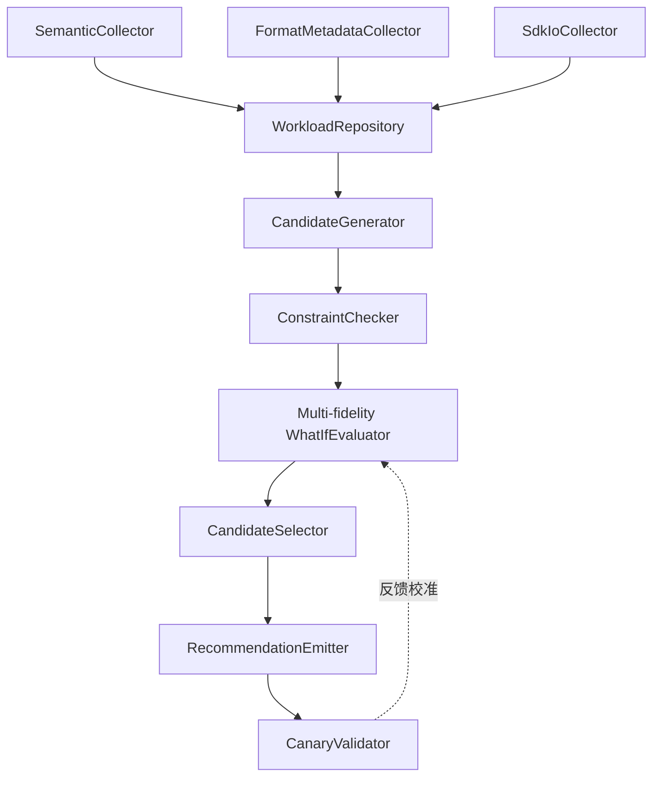

# Track 2：对象存储感知的 Writer Layout Advisor 工作计划

> **文档定位**
>
> - `PROJECT3.md` 是项目总路线的权威来源。
> - `TRACK2_PROJECT.md` 保存 Track 2 的研究判断、范围调整和变更记录。
> - 本文件只描述 Track 2 的后续工作计划，不表示其中任务已经实施或完成。

---

## 1. 目标与成功标准

### 1.1 总体目标

构建一个面向 Parquet 湖仓的建议式 Writer Advisor：联合查询语义、Parquet 元数据和 SDK 物理 IO，发现布局问题，
生成可审核的 Writer 参数建议与最小 Code Diff，并通过真实对象存储验证收益。这份工作是实现在 SDK 上的可插拔非侵入式 Advisor。

核心主张是：

> 性能证据决定改什么；AI 负责定位 Writer 代码、生成 Diff 和解释建议，不负责性能判断。

### 1.2 成功标准

- 在 TPC-H SF100、同 region AWS S3 上完成“采集 → 分析 → 建议 → 重写 → 复测”闭环。
- 相对默认布局，完整 workload 端到端 wall-clock median 改善至少 10%。
- 每个配置至少运行 5 次；基线重复运行的变异系数（CV）低于 5%。
- 单查询 median 不回归超过 10%，workload P95/P99 不回归超过 5%，峰值内存增长不超过 10%。
- 同时报告 GET、remote bytes、读放大、files/row groups/pages touched、CPU、rewrite cost 和回收周期。
- 若 8 月底未达到 10% 门槛，停止扩张，Track 2 降为论文 discussion。

### 1.3 范围边界

- 不修改 Parquet 格式，不引入影响文件可读性的外部地址映射。
- 不做列/记录复制、Qd-tree、BID、查询改写或自动合并 PR。
- 依赖图与跨组件联合编排后置，不阻塞第一版。
- TPC-H 用于总体 MVP；列顺序需另设宽表实验，不计入首轮成功门槛。
- 本计划不授权自动删除旧布局、冷字段或历史数据。

---

## 2. 整体架构



### 2.1 观测层

三类 Collector 分工如下：

| Collector | 采集内容 | 主要来源 |
| --- | --- | --- |
| `SemanticCollector` | predicate、filter/project columns、scan fragment、rows in/out、查询频率 | Spark/Trino/Presto/Velox 的 plan/event adapter |
| `FormatMetadataCollector` | object-version 到 row group、column chunk、page/index、min/max、Bloom、encoding 的映射 | Parquet footer 或 Reader 已解析的 metadata |
| `SdkIoCollector` | offset/length、GET、remote bytes、时延、重试、并发 | SDK / Range Reader 热路径 |

三层数据通过 `query/span ID + object key + version/snapshot + time window` 关联。

### 2.2 Advisor 控制面

1. `WorkloadRepository`：保存三层 telemetry、执行频率、观测窗口和覆盖率。
2. `CandidateGenerator`：按动作族提出少量候选。
3. `ConstraintChecker`：检查格式兼容、Writer/Reader 能力、资源预算、回归与 rewrite payback。
4. `WhatIfEvaluator`：逐级估算候选的裁剪、物理 IO 和 wall-clock。
5. `CandidateSelector`：按多维预算选择 Pareto 候选和 best-so-far。
6. `RecommendationEmitter`：生成证据、预测、Writer Code Diff、迁移和回滚方案。
7. `CanaryValidator`：在真实 Reader 与对象存储上复测，并校准成本模型。

第一版不实现 `DependencyPlanner`。只有跨组件组合数量或相互影响成为主要瓶颈时，才考虑显式依赖关系和联合编排。

---

## 3. 数据契约

### 3.1 ObservationBundle

`ObservationBundle` 至少包含：

- query/scan/span ID、table、snapshot/version、时间窗口和执行频率；
- predicate、filter/project columns、rows in/out；
- object key/version、row group、column chunk，以及可用时的 page 映射；
- offset/length、GET、remote bytes、延迟、重试和并发；
- scan-stage 与 end-to-end wall-clock。

### 3.2 LayoutCandidate

所有候选使用统一的中间表示：

```text
LayoutCandidate = {
  scope,
  actions[],
  prerequisites[],
  conflicts[],
  evidence[],
  predicted_metrics,
  uncertainty,
  rewrite_cost,
  storage_delta,
  patch,
  rollout,
  rollback
}
```

### 3.3 RecommendationPackage

最终建议包至少包含：

- workload 窗口、数据快照、观测覆盖率和置信度；
- 基线与建议参数、证据和预期指标；
- 受益查询与可能回归查询；
- Writer 最小 Code Diff；
- rewrite cost、payback、canary、迁移和回滚方案；
- 建议有效期和重新评估条件。

---

## 4. 候选动作与实验优先级

### 4.1 首轮候选空间

1. PTO 兼容动作：partition、target file size、row-group size、sort。
2. 扩展动作：page size/index、Bloom、per-column dictionary 与 compression。
3. 列顺序作为后续宽表专项，不进入 TPC-H 首轮门禁。

### 4.2 实验隔离

- Writer 布局比较期间保持 Reader 策略固定。
- Reader Range merge 联动只做敏感性分析，不与 Writer 同时自适应。
- 基线与候选只改变待验证布局变量；查询、客户端规格、云环境和对象版本策略保持一致。
- cold-cache 与 steady-state 分开报告，主 profile 必须在实验前声明。

---

## 5. 多保真 What-if

```text
L0 静态可行性检查
  → L1 解析型布局/IO模型
  → L2 结构保真样本改写与残差校准
  → L3 真实云 top-k canary
  → SF100 完整 workload 验收
```

### 5.1 L0：静态检查

- Writer 是否支持目标参数和 per-column 配置；
- Reader 是否消费 page index、Bloom 和 dictionary filtering；
- schema、格式、分区和版本兼容性；
- 文件数、额外存储、rewrite bytes、内存和实验预算；
- dictionary fallback、page boundary 和 Range merge 等离散约束。

### 5.2 L1：解析模型

模型按以下链路估价：

```text
布局参数
  → files / row groups / pages touched
  → projected compressed bytes
  → Reader Range 请求计划
  → GET 数、有效传输字节、并发 waves
  → IO critical-path wall-clock
```

初始使用 ATUN-HL 的有序/无序成本分支。基于真实 row-group min/max overlap、命中率、偏斜和 clustering quality 的
经验分支作为可证伪实验；只有它改善候选排序和 selection regret 时才保留。

### 5.3 L2：样本改写与模型校准

- 样本必须形成足够的文件、row group 和 page，不能简单按采样率同比缩小所有参数。
- 对少量候选执行真实 Parquet rewrite 和 Reader 测量。
- 解析模型作为先验；轻量 surrogate 学习其未覆盖的 CPU、调度、缓存、并发和长尾残差。
- 搜索可使用压缩 workload，但最终候选必须回到完整 workload 复核。

### 5.4 L3：真实云验证

- 只把 top-k 候选送入 AWS S3 canary。
- 候选排序目标是 scan-stage / IO critical-path wall-clock median。
- 最终验收目标是完整 workload 的端到端 wall-clock median。
- skipped rows、GET、bytes 和 pruning 仅作为解释与代价指标，不能替代最终目标。

---

## 6. 下一步上手

### 第一步：冻结实验合同

- 固定 TPC-H 查询集、执行频率、SF100 数据生成规则、Reader 版本和配置。
- 定义 `ObservationBundle`、`LayoutCandidate` 和 `RecommendationPackage`。
- 建立 Writer × Reader capability matrix。
- 冻结默认布局、候选参数档位、主 profile 和指标口径。

### 第二步：完成三层观测闭环

- 从执行计划获取 predicate、projection 和 scan fragment。
- 解析 Parquet footer，建立 object-version 到 row group/column chunk/page 的映射。
- 关联 SDK Range GET 与查询 span。
- 目标是至少 95% 的 GET 可映射到 query → object → row group/column chunk。
- page 覆盖率单独报告；不支持时不得声称 page 级归因。

### 第三步：建立基线与可控布局矩阵

- Default Parquet；
- 单旋钮 target file size、row-group size、partition 和 sort；
- PTO 四参数联合候选；
- 扩展动作逐项加入。

每个配置至少独立运行 5 次，保存原始结果、环境元数据、数据生成参数和 Writer 版本。

### 第四步：实现并校准 What-if

- 先验证 pruned row groups、bytes 和 GET，再验证 wall-clock 排序。
- L1 门禁：top-3 包含实测最佳候选，或所选候选相对实测最佳的 selection regret 不超过 5%。
- 不满足时进入 L2 残差校准，不通过更换有利指标掩盖误差。

### 第五步：生成建议与 Diff

- 将最佳候选映射到 Writer 参数和 schema 定义位置。
- AI 只生成最小 Diff、解释和验证步骤。
- 人工审核后生成新布局；旧布局保留至 canary 通过。
- 不因当前窗口未访问某列或布局而自动删除数据。

---

## 7. 里程碑

| 时间 | 里程碑 | 交付物 | 门禁 |
| --- | --- | --- | --- |
| 8 月 5–7 日 | M0 计划冻结 | 数据合同、指标、候选档位、能力矩阵、实验清单 | 主目标与边界无未决项 |
| 8 月 8–12 日 | M1 观测与基线 | 三层关联报告、默认布局 SF100 基线 | 映射覆盖率 ≥95%；5 次运行 CV <5% |
| 8 月 13–17 日 | M2 What-if v1 | L0/L1 模型、ATUN binary 对照、候选排名报告 | top-3 命中最佳或 regret ≤5% |
| 8 月 18–23 日 | M3 小规模闭环 | 分析报告、建议 JSON、一次真实 Writer Diff、sample rewrite | 采集到复测全链路可重复 |
| 8 月 24–28 日 | M4 SF100 门禁 | AWS S3 完整实验、原始结果、环境元数据 | wall-clock 改善 ≥10% 且 guardrail 通过 |
| 8 月 29 日–9 月 7 日 | M5 扩展实验 | PTO → +page/index/Bloom/dictionary 消融；经验成本分支实验 | 证明扩展动作或模型细化的增量价值 |
| 9 月 8–15 日 | M6 论文冻结 | 图表、方法描述、负结果、related work、可复现实验清单 | 进入可撰写状态，不再扩动作空间 |

### 7.1 M4 决策

- **通过**：Track 2 升为论文贡献点，继续 M5 消融和可选双云补充。
- **未通过**：立即止损，保留 Advisor 架构、成本模型误差和负结果，论文降为 discussion，不继续增加布局动作。

---

## 8. 实验与验收要求

### 8.1 必做实验

- Default、单旋钮、PTO 四参数和扩展动作的递增消融；
- skipped rows、bytes、GET、scan wall-clock 与 end-to-end wall-clock 的相关性；
- ATUN binary 与真实统计成本分支的 selection regret 对照；
- Writer 布局固定、Reader 策略固定的因果实验；
- 预测误差、top-k recall、rewrite payback 和单查询回归；
- workload 漂移或不同数据分布下的稳定性检查。

### 8.2 指标与 guardrail

| 类别 | 指标 |
| --- | --- |
| 候选排序主指标 | scan-stage / IO critical-path wall-clock median |
| 最终验收主指标 | 完整 workload end-to-end wall-clock median |
| 尾延迟 | P50/P95/P99/P999 |
| 对象存储代价 | GET、remote bytes、读放大、重试 |
| 布局解释 | files/RGs/pages touched、min/max/page/Bloom/dictionary pruning |
| 本地资源 | CPU、峰值内存、解压/解码时间 |
| 迁移代价 | rewrite bytes、rewrite time、storage delta、payback |

禁止以 cache hit rate、remote bytes 或 skipped rows 单独作为优化目标。

---

## 9. Related Work 定位

- **PTO**：四参数联合布局与 sample/surrogate 的直接 baseline。
- **ATUN-HL**：解析型 row-group/dictionary 成本模型先例。
- **DB2 Design Advisor**：候选生成/评估分离和建议式控制面参考。
- **宽表列布局优化**：列顺序候选与对象存储成本改写参考。
- **Qd-tree**：高自由度 record-to-block routing 方案，只作 related work，不实现。

---

## 10. 执行假设

- 本文件是研究与实验计划，不指定当前文档目录中的代码落点。
- 执行阶段需接回原实现仓库及 TPC-H、trace、S3 replay 资产，不在当前文档目录重建。
- AWS S3 是主环境；COS 仅在 M4 通过且时间允许时补充。
- 所有执行变更、失败结果和范围调整继续记录到 `TRACK2_PROJECT.md`。
s